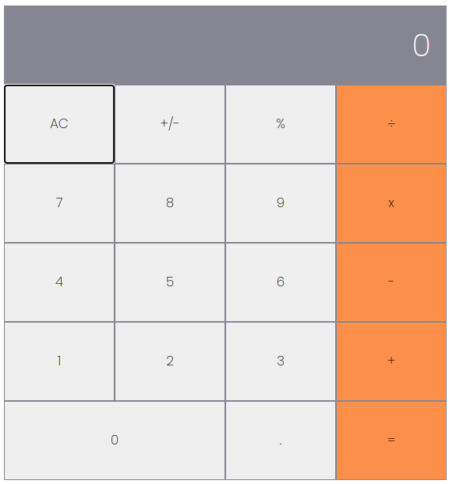

# Math Magicians

"Math magicians" is a website for all fans of mathematics. It is a Single Page App (SPA) that allows users to:

Make simple calculations.
Read a random math-related quote.

## Screenshot

## Built With

- React
- SCSS

## Live Demo

[Heroku](https://math-magicians-rokovarano.herokuapp.com/calculator)
[Netlify](https://6123dc6f47f0e900ef92f8ee--sleepy-spence-ad1d64.netlify.app/)

## Getting Started

**This is an example of how you may give instructions on setting up your project locally.**
**Modify this file to match your project, remove sections that don't apply. For example: delete the testing section if the currect project doesn't require testing.**

To get a local copy up and running follow these simple example steps.

### Prerequisites
- Node.js
### Setup
- clone the Repo: https://github.com/RokoVarano/math-magicians.git
### Install
- 
- In the cloned project folder, run 'npm run start'
### Usage
- click on the buttons on the top to access each section.
- click on a number button, then on an operation to get the result displayed on the grey bar.
- click on A/C to clear all operations.
### Run tests
- in terminal, type 'npm run test'
## I learned:
- how to setup a react project using create-react-app
- how to use states and props to pass information between components
- how to handle onClick events
- how to use hooks and function components
- how to use Router to create links in React that change the URL
- how to create tests for React components
- how to use snapshots to test React components
## Authors

👤 **Rodrigo Ibaceta**

- GitHub: [Rodrigo Ibaceta](https://github.com/RokoVarano/)
- Twitter: [@Rodrigo](https://twitter.com/RodrigoIbacet11)
- LinkedIn: [LinkedIn](https://www.linkedin.com/in/rodrigo-ibaceta-a8657611a/)
## 🤝 Contributing

Contributions, issues, and feature requests are welcome!

Feel free to check the [issues page](https://github.com/RokoVarano/math-magicians/issues).

## Show your support

Give a ⭐️ if you like this project!

## Acknowledgments

- Hat tip to anyone whose code was used
- Inspiration
- etc

## 📝 License

This project is [MIT](https://opensource.org/licenses/MIT) licensed.